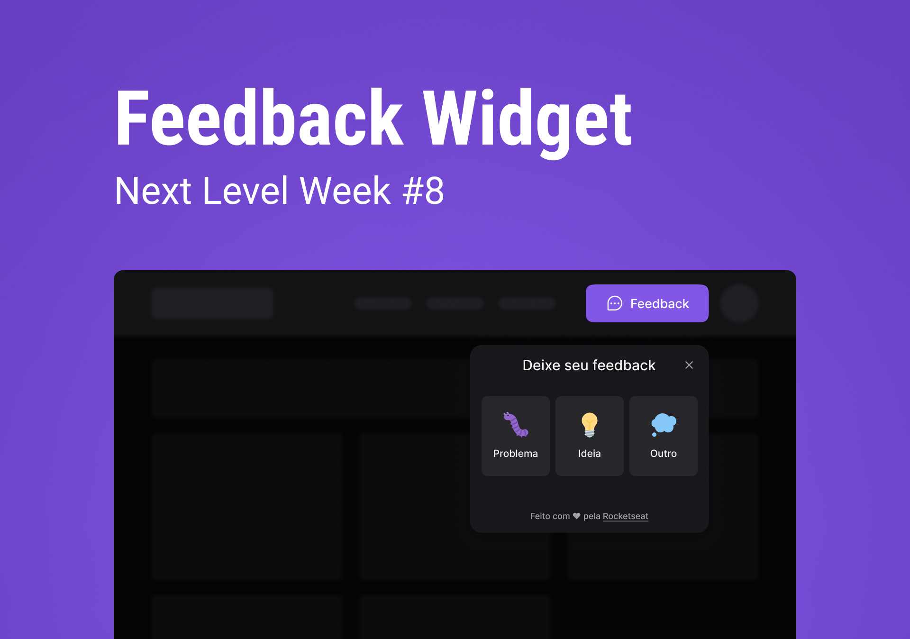

<h1 align="center">
  
</h1>

<p align="center">

  
  
  
  
  

  

  
  
  <br>
  
  <a href="https://github.com/glaubermatos/feedback-widget/commits/master">
    
  </a>
    
  

</p>


<h4 align="center"> 
	🚧  Trilha impulse finalizada! 🚧
</h4>

## 🏁 Tópicos

<p>
 👉<a href="#-sobre-o-projeto" style="text-decoration: none; "> Sobre o projeto</a> <br/>
👉<a href="#-funcionalidades" style="text-decoration: none"> Funcionalidades</a> <br/>
👉<a href="#-layout" style="text-decoration: none; "> Layout</a> <br/>
👉<a href="#-milha-extra" style="text-decoration: none; "> Milha extra</a> <br/>
👉<a href="#-tecnologias" style="text-decoration: none; "> Tecnologias</a> <br/>
👉<a href="#-como-executar-o-projeto" style="text-decoration: none"> Como executar</a> <br/>
👉<a href="#-autor" style="text-decoration: none"> Autor</a> <br/>
👉<a href="#-user-content--licença" style="text-decoration: none"> Licença</a>

</p>
<br>

<a name="-sobre-o-projeto"></a>

## 📚 Sobre o projeto


#### 👉 Projeto Fullstack ReactJS + NodeJS
<br>

Projeto fullstack desenvolvido durante a trilha impulse da 8° edição da Next Level Week da Rocketseat.

Aplicação front-end desenvolvida com ReactJS consiste em um widget para coleta de feedbacks dos usuários, permitindo tirar uma screenshot da tela.

O back-end desenvolvido em NodeJS recebe os dados do feedback do usuário e salva em um banco de dados PostgreSQL e envia um email para o administrador do site.

#### 🎓 Instrutor
- ReactJS + NodeJS - [Diego Fernandes](https://www.linkedin.com/in/diego-schell-fernandes/)

<br>

Para conferir o resultado só clicar no link abaixo:

<a align="center" href="https://feedback-widget-glauber.vercel.app/">
    
</a>

---

<a name="-funcionalidades"></a>

<br>

## 🎯 Funcionalidades

- ✔️ Envio de feedbacks (Problemas, Idéias, Outro)
- ✔️ Capturar screenshot do usuário com html2canvas
- ✔️ Uso do MailTrap para o envio de e-mails

<br>

---


<a name="-layout"></a>

## 🎨 Layout


Você pode visualizar o layout do projeto através do link abaixo, é preciso ter uma conta no [figma](https://www.figma.com/)

- **[Layout Frontend](https://www.figma.com/community/file/1102912516166573468/Feedback-Widget)** (Criado por @ilanamallak)

<br>

<p align="left">
  <br />
  
</p>

<br>

---


<a name="-milha-extra"></a>

<br>

## ✈️ Milha extra

- ✔️ Tema light e dark (de acordo com as preferências do usuário)
- ✔️ README.md
- [ ] Validação do formulário
- [ ] Dashboard para visualizar todos os feedbacks
- [ ] Autenticação para acesso ao Dashboard
- [ ] Envio do email com Mailchimp ou outro

<br>

---

<br>

<a name="-tecnologias"></a>

## 🧪 Tecnologias


- ### 🤖 **Server**
  Rest API  desenvolvido em NodeJS e Typescript: 

  - **[NodeJS](https://nodejs.org/en/)**
  - **[TypeScript](https://www.typescriptlang.org/)**
  - **[Express](https://nodejs.org/en/)** (Trabalhar com rotas HTTP)
  - **[Prisma](https://www.typescriptlang.org/)** (ORM)
  - [Jest](https://jestjs.io/) - (Testes unitários)
  - [nodemailer](https://nodemailer.com/) - (Módulo para NodeJS que facilita o envio de email)
  - [SQlite](https://www.sqlite.org/) (Banco de dados para ambiente de desenvolvimento)
  - [PostgreSQL](https://www.postgresql.org/) - (Banco de dados em produção)

  <br>

  > Veja o arquivo [package.json](https://github.com/glaubermatos/feedback-widget/blob/main/server/package.json)

  <br>


- ### 💻 **Web**
  Aplicação web ReactJS e Typescript: 
  
  - **[Vite](https://vitejs.dev/)**
  - **[ReactJS](https://reactjs.org/)**
  - **[TypeScript](https://www.typescriptlang.org/)**
  - **[Tailwindcss](https://tailwindcss.com/)** - (Estilização)
  - [Phosphor React](https://phosphoricons.com/) - (Ícones)
  - [Axios](https://github.com/axios/axios) - (Requisições HTTP)
  - [Headless-ui](https://headlessui.dev/) - (Popover com acessibilidade)
  - [Html2Canvas](https://html2canvas.hertzen.com/) - (Screenshot da tela)

  <br>

  > Veja o arquivo [package.json](https://github.com/glaubermatos/feedback-widget/blob/main/web/package.json)

  <br>


#### 🛠️ **Utilitários**

- Editor: **[Visual Studio Code](https://code.visualstudio.com/)**
- Teste de API: **[Insomnia](https://insomnia.rest/)**
- Sandbox para envio de e-mails: **[MailTrap](https://mailtrap.io/)** 

<br>

---

<!-- <a name="-demonstracao"></a>

<br>

## 🕹️ Demonstração

<a align="center" href="https://www.linkedin.com/posts/glaubermatos_desenvolvimentoweb-springboot-nextjs-activity-6905992105182015488-CfRu">
    
</a>

<br>

--- -->

<br>

<a name="-como-executar-o-projeto"></a>

## 🚀 Como executar o projeto

### **Pré-requisitos**

Antes de começar, você vai precisar ter instalado em sua máquina as seguintes ferramentas:
[Git](https://git-scm.com), [NodeJS](https://nodejs.org/en/), [NPM](https://www.npmjs.com/).
Além disto é bom ter um editor para trabalhar com o código como [VSCode](https://code.visualstudio.com/).

Primeiro faça o clone do projeto

```bash
# Clone este repositório
$ git clone https://github.com/glaubermatos/feedback-widget.git
```


<br>

### 🤖 **Para executar o back-end (server)**

#### 👉 Variáveis de ambiente do back-end

Necessário para configurar o sqlite em ambiente de desenvolvimento

```bash

# Faça uma cópia do arquivo .env.example para a raiz do projeto back-end renomeando para .env (este por sua vez será ignorado pelo Git):
$ cp .env.example .env
```

```bash
# Acesse a pasta do projeto no seu terminal/cmd
$ cd feedback-widget/server

# Instale as dependências
$ npm install

# Execute o prisma migrate para criar e aplicar as migrations no banco de dados
$ npx prisma migrate dev

# Execute a aplicação em modo de desenvolvimento
$ npm run dev

# O servidor estará executando na porta:3333
```

Use o [Insomnia](https://insomnia.rest/) para testar a rota de cadastro passando um objeto JSON contendo os dados do feedback.

> POST http://localhost:3333/feedbacks

```JSON
{
  "type": "BUG",
  "comment": "Ta tudo bugado!"
}
```

<br>

### 💻 **Para executar o front-end (web)**

<br>


❗ **NOTE** O back-end precisa estar rodando para que o projeto web possa enviar os dados do feedback.
<br>

#### 👉 Variáveis de ambiente do front-end

Necessário para configurar o endereço do backend para o axios realizar a requisição HTTP.

```bash

# Faça uma cópia do arquivo .env.local.example para a raiz do projeto web renomeando para .env.local (este por sua vez será ignorado pelo Git):
$ cp .env.local.example .env.local
```

```bash
# Acesse a pasta do projeto no seu terminal/cmd
$ cd feedback-widget/web

# Instale as dependências
$ npm install

# Execute a aplicação em modo de desenvolvimento
$ npm run dev

# O front-end web estará executando no endereço http://localhost:3000
```


<br>

---

<br>

<a name="-autor"></a>

## 👨‍🚀 Autor

<br>

<p>
 
 <br />
 <sub><strong>🌟 Glauber de Oliveira Matos 🌟</strong></sub>
</p>

[](https://www.linkedin.com/in/glaubermatos/)

<br>

---

<br>

<a name="-user-content--licença"></a>

## 📝 Licença

Este projeto esta sobe a licença [MIT](./LICENSE).

Feito com :satisfied: por Glauber de Oliveira Matos 👋🏽 [Entre em contato!](https://www.linkedin.com/in/glaubermatos/)

<br>